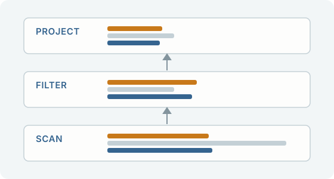

(cover)=
*Build a query engine to learn what a query costs.*

A hands-on book for data engineers who run queries every day and want to know what they cost.
You build a small query engine in Python on Apache Arrow, one operator at a time, and hold every
operator to DuckDB: the rows it moves, the bytes it reads, the memory it holds. Before each
measurement you predict it. Every number in the book is computed by an engine when the book is
built, and every panel can run again in your browser. [Start with the Preface](#preface) to see
how a chapter works and what you need.

By Chris Snow, in collaboration with Claude (Anthropic)

% number-ok: the names of the two licences, which carry their version numbers
The prose and figures are under [CC BY-NC 4.0](https://github.com/snowch/query-engine-book/blob/main/LICENSE); the code is under [Apache 2.0](https://github.com/snowch/query-engine-book/blob/main/LICENSE-CODE).
